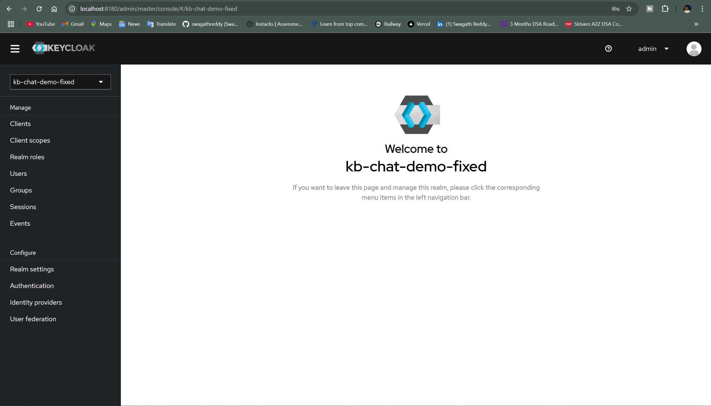
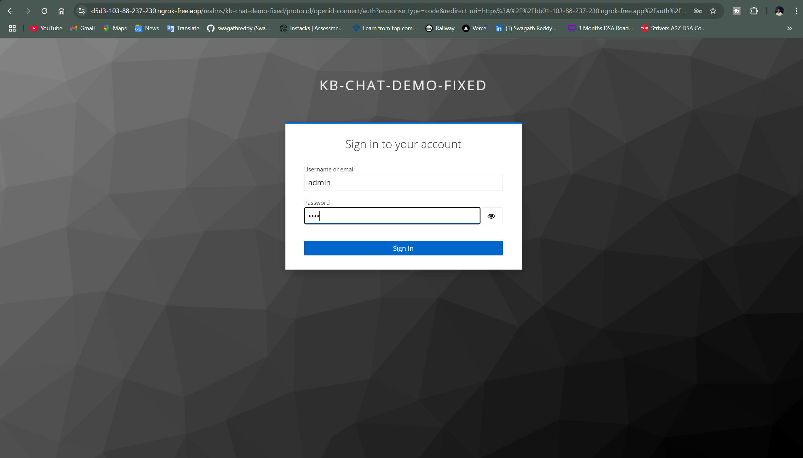
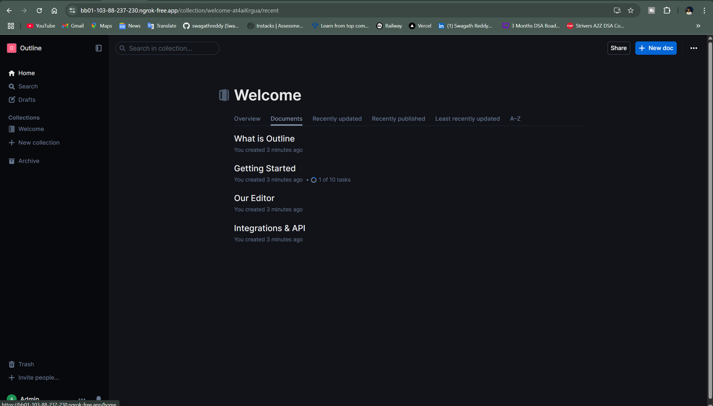
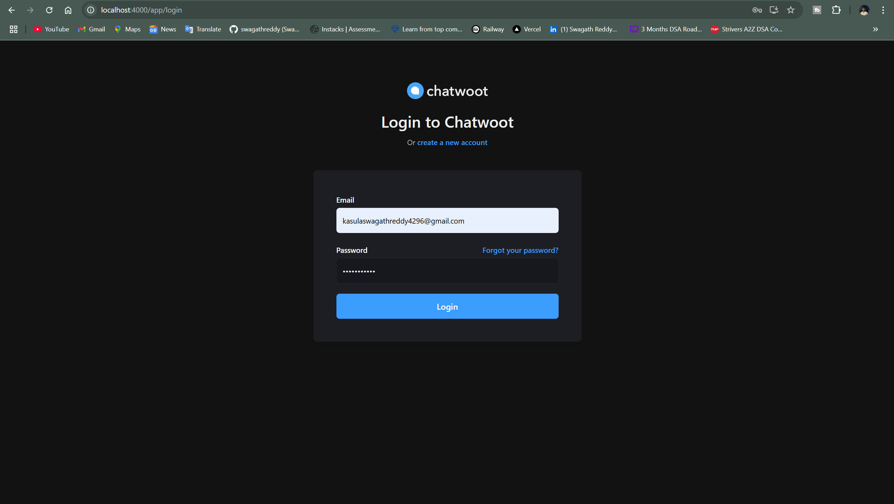
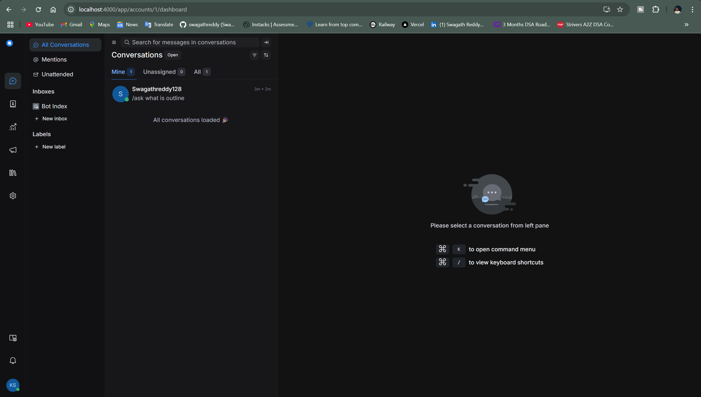
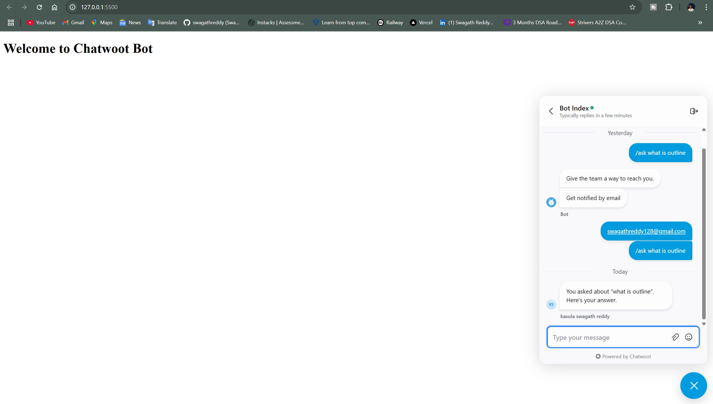

# Project: Outline + Keycloak + Chatwoot Integration with Bot Webhook

This project demonstrates the integration of three major services:

* **Keycloak**: For authentication (OIDC based SSO)
* **Outline**: As a knowledge base platform (OIDC login via Keycloak)
* **Chatwoot**: For customer chat support (web UI + webhook automation)
* **Custom Bot (Node.js)**: Responds to messages in Chatwoot by fetching answers from a mock Outline API

---

## 🗂️ Project Structure

```
project-work/
├── bot/
│   └── index.js             # Chatwoot bot logic
├── mock-outline-api.js      # Simulates Outline's /api/docs endpoint
├── .env                     # Environment variables for bot
├── docker-compose.yml       # Brings up all services
└── keycloak/
    └── realm-export.json    # Preconfigured Keycloak realm with OIDC setup for Outline
|__ index.html
|__ package.json
|__ package-lock.json
```

---

## ✅ Setup Summary

### 1. **Keycloak Setup**

* Realm: `kb-chat-demo-fixed`
* Client: `outline` (OIDC protocol)
* Admin user created via `realm-export.json`
* Running at: `http://localhost:8180`

### 2. **Outline Setup**

* Configured with OIDC client info from Keycloak
* **Note**: Outline doesn't support direct `http://localhost` due to `secure cookies` and CORS.
* I used **Ngrok** to expose it at a public HTTPS endpoint:

  `https://<ngrok-subdomain>.ngrok-free.app` ➝ mapped to local port 4100

### 3. **Chatwoot Setup**

* Running at `http://localhost:4000`
* Inbox Created: `Bot Index`
* Agent Added: Your user as Admin and another user as Agent
* Automation Rule:

  * **Trigger**: When message is created
  * **Condition**: Message type = "Incoming Message"
  * **Action**: Send Webhook to `http://host.docker.internal:7000/webhook`

### 4. **Bot Setup (Node.js)**

* `bot/index.js` listens on port 7000
* Listens for `/ask <query>` format
* Calls mock Outline API at `http://localhost:7001/api/docs?q=<query>`
* Posts result back to Chatwoot via API
* Environment config used from `.env`:

```env
CHATWOOT_API=http://localhost:4000/api/v1
CHATWOOT_BOT_TOKEN=<your-access-token>
INBOX_ID=1
PORT=7000
```

---

## ✅ Test Flow (Confirmed Working)

1. Login to Outline via **Keycloak SSO** ✅
2. Send message `/ask what is outline` in Chatwoot ✅
3. Automation rule triggers webhook to Node.js bot ✅
4. Bot queries mock Outline and posts back answer ✅

**Bot Response Example:**

> You asked about "what is outline". Here's your answer.

---

## 🖼️ Evidence

We recommend including the following in your submission:

### Screenshots

* ✅ Keycloak realm + client settings

* ✅ Outline login and dashboard (via Ngrok URL)


* ✅ Chatwoot Inbox + Automation Rule + Agent screen


* ✅ Chatwoot Chat window with `/ask` request and bot reply



## ✅ Conclusion

This implementation successfully integrates all components:

* 🔐 **SSO with Keycloak**
* 📚 **Knowledge base via Outline**
* 💬 **Chat interface and automation with Chatwoot**
* 🤖 **Bot that dynamically responds using Outline-styled answers**

Let me know if you want a video recorded or help drafting the submission email.
